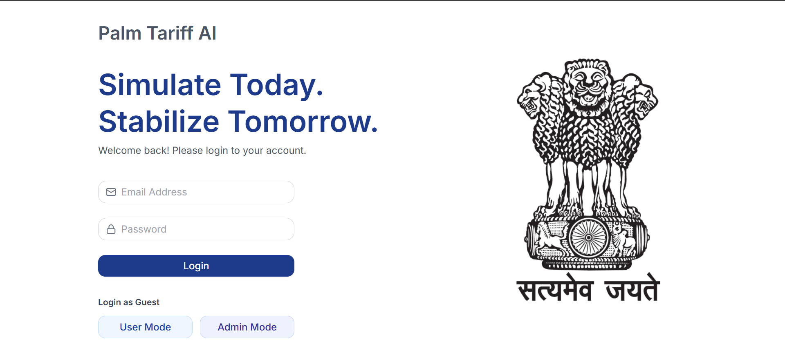
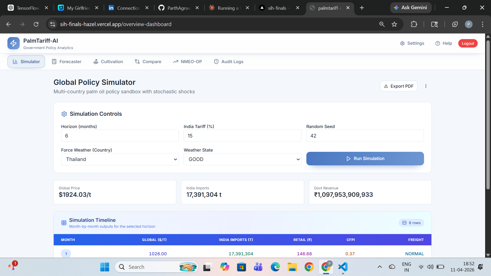
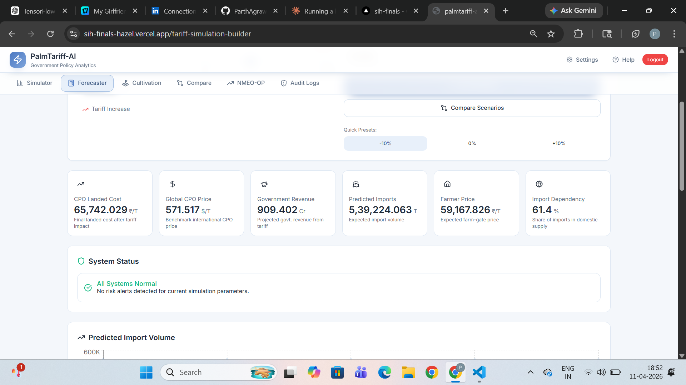
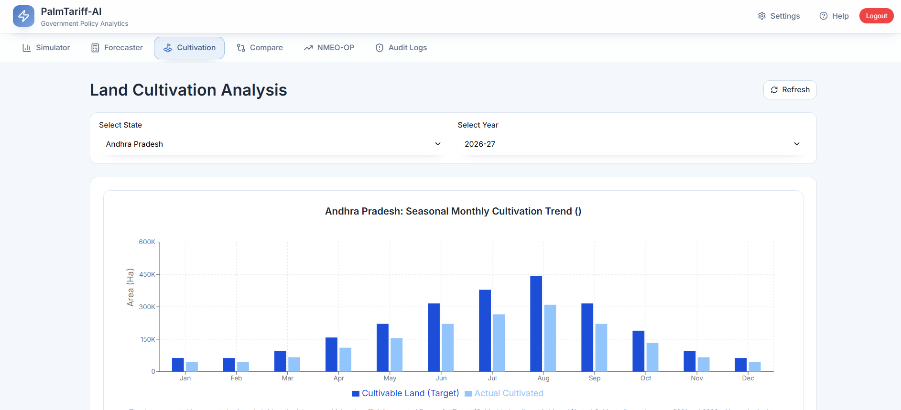
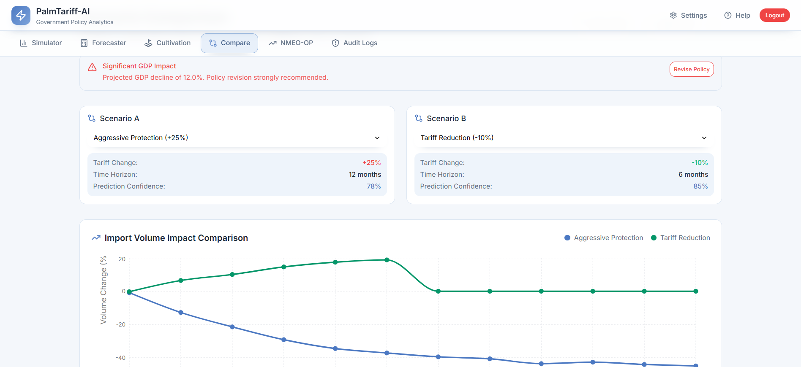
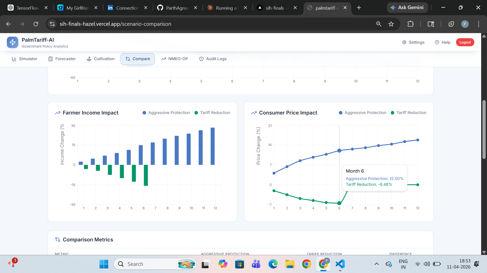
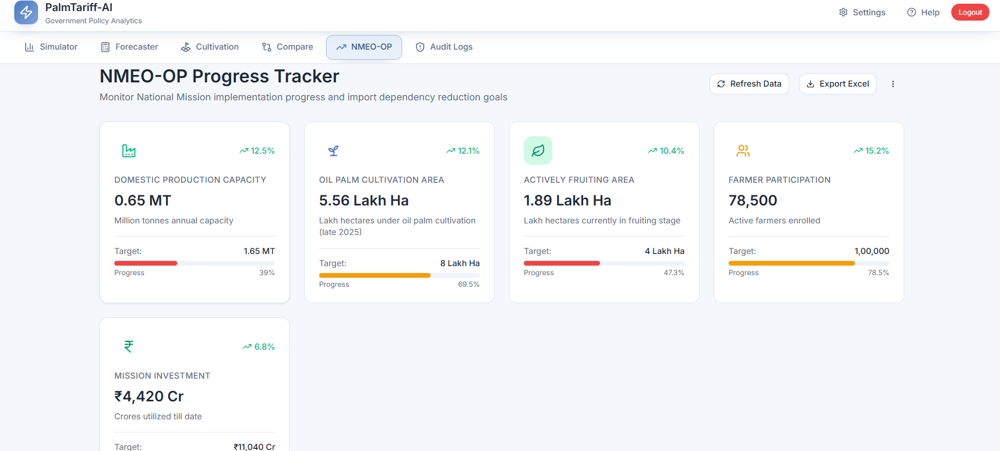
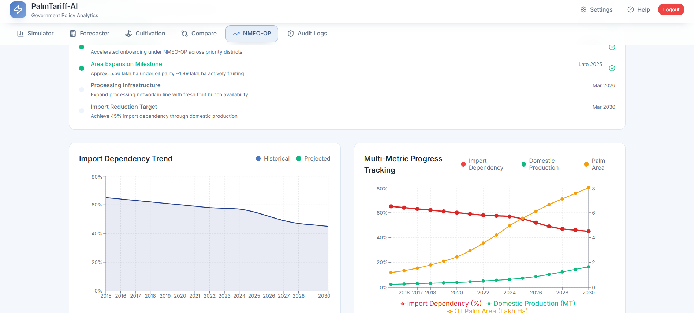
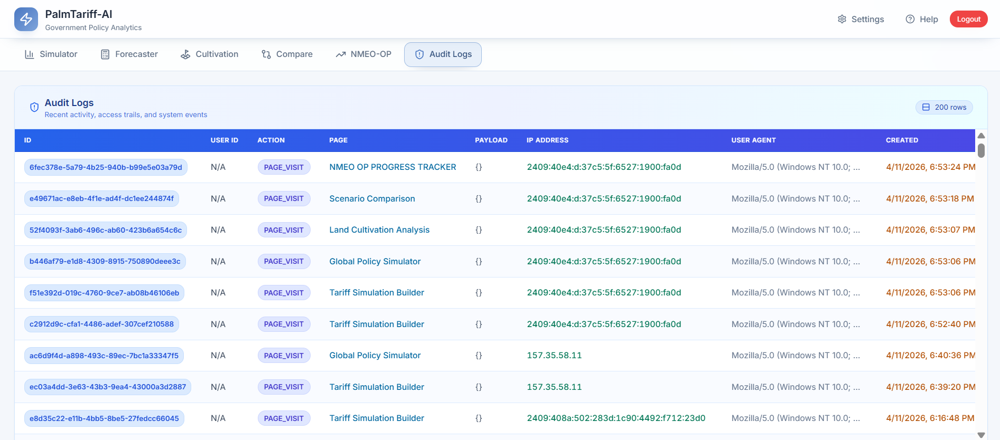

#  PalmTariff-AI — Government Policy Analytics Platform

> **Simulate Today. Stabilize Tomorrow.**

PalmTariff-AI is an AI-powered tariff simulation and policy analytics platform built for the Government of India's palm oil import policy decision-making. It combines machine learning models (LSTM + XGBoost), real-time economic computations, and an interactive dashboard to help policymakers evaluate the downstream effects of CPO (Crude Palm Oil) import tariff changes.

Built as part of **Smart India Hackathon (SIH) 2024**, this platform addresses India's dependence on palm oil imports and supports the **NMEO-OP (National Mission on Edible Oils – Oil Palm)** implementation goals.

---

## 🔗 Live Demo

- **Frontend:** [https://sih-finals-hazel.vercel.app](https://sih-finals-hazel.vercel.app)
- **Backend API:** [https://sih-finals.onrender.com](https://sih-finals.onrender.com)
- **API Docs:** [https://sih-finals.onrender.com/docs](https://sih-finals.onrender.com/docs)

---

## 🖼️ Screenshots

### Login Page

*Secure login with User Mode and Admin Mode access. Government of India branding with Satyamev Jayate.*

---

### Global Policy Simulator

*Multi-country CPO policy sandbox with stochastic weather shocks, month-by-month simulation timeline showing global price, India imports, retail price, CFPI, and freight conditions.*

---

### Tariff Simulation Builder (Forecaster)

*Configure tariff adjustments (-50% to +50%), projection time horizon, and run ML-powered simulations. Real-time KPI cards showing CPO Landed Cost, Global CPO Price, Government Revenue, Predicted Imports, Farmer Price, and Import Dependency.*

---

### Land Cultivation Analysis

*State-wise seasonal monthly cultivation trend analysis. Compare cultivable land targets vs actual cultivated area across all NMEO-OP states with year-wise filtering.*

---

### Scenario Comparison


*Side-by-side comparison of two tariff scenarios (e.g., Aggressive Protection +25% vs Tariff Reduction -10%). Visualizes Import Volume Impact, Farmer Income Impact, Consumer Price Impact, and Comparison Metrics table.*

---

### NMEO-OP Progress Tracker


*Live tracking of National Mission on Edible Oils progress. KPI cards for Domestic Production Capacity, Oil Palm Cultivation Area, Actively Fruiting Area, Farmer Participation, and Mission Investment. Includes Import Dependency Trend and Multi-Metric Progress charts.*

---

### Audit Logs

*Complete audit trail of all user actions — page visits, simulation runs, exports — with User ID, Action, Page, Payload, IP Address, User Agent, and Timestamp.*

---

## ✨ Features

### 🔐 Authentication & Access Modes

| Feature | User Mode | Admin Mode |
|---|---|---|
| Run Simulations | ✅ | ✅ |
| View Forecasts | ✅ | ✅ |
| Export PDF/Excel | ✅ | ✅ |
| NMEO-OP Dashboard | ✅ | ✅ |
| Audit Logs | ❌ | ✅ |
| Guest Access | ✅ (limited) | ✅ (full) |

- **User Mode** — Standard access for analysts and researchers. Can run simulations, view forecasts, and export reports.
- **Admin Mode** — Full access including Audit Logs showing all system events, user activity trails, page visits, simulation payloads, and IP addresses.
- **Guest Login** — Quick access without credentials for demo purposes (limited features).
- Powered by **Supabase Auth** with Row Level Security (RLS).

---

###  Global Policy Simulator
- Multi-country CPO policy sandbox
- Stochastic weather shock simulation (Good/Normal/Bad weather by country)
- Configurable parameters: Horizon (months), India Tariff (%), Random Seed, Force Weather Country
- Real-time outputs: Global Price ($/t), India Imports (tonnes), Govt Revenue (₹)
- Month-by-month Simulation Timeline table
- Export as PDF

###  Tariff Simulation Builder (Forecaster)
- Tariff adjustment slider: -50% to +50%
- Projection time horizons: 1 to 12 months
- Scenario types: Baseline, Aggressive Protection, Tariff Reduction, Custom
- Quick Presets: -10%, 0%, +10%
- Real-time KPI cards:
  - CPO Landed Cost (₹/T)
  - Global CPO Price ($/T)
  - Government Revenue (Cr)
  - Predicted Imports (Tonnes)
  - Farmer Price (₹/T)
  - Import Dependency (%)
- Charts: Predicted Import Volume, Landed Cost Trend
- System Status indicator
- Export as Excel

###  Land Cultivation Analysis
- State-wise seasonal monthly cultivation trend
- Filter by State and Financial Year
- Bar charts comparing Cultivable Land (Target) vs Actual Cultivated area
- Covers all NMEO-OP implementation states

###  Scenario Comparison
- Compare two tariff scenarios side-by-side
- Visualizations:
  - Import Volume Impact Comparison (line chart)
  - Farmer Income Impact (bar chart)
  - Consumer Price Impact (line chart)
  - Comparison Metrics Table
- GDP Impact Alert system
- Prediction Confidence scores per scenario

###  NMEO-OP Progress Tracker
- Live mission implementation monitoring
- KPI Cards:
  - Domestic Production Capacity (MT)
  - Oil Palm Cultivation Area (Lakh Ha)
  - Actively Fruiting Area (Lakh Ha)
  - Farmer Participation (count)
  - Mission Investment (₹ Cr)
- Charts:
  - Import Dependency Trend (Historical + Projected)
  - Multi-Metric Progress Tracking (Import Dependency, Domestic Production, Palm Area)
- State-wise regional data with achievements and challenges
- Refresh Data and Export Excel buttons
- External data source integration via `NMEO_STATEWISE_SOURCE_URL`

###  Audit Logs *(Admin Only)*
- Complete activity trail: 200+ rows
- Columns: ID, User ID, Action, Page, Payload, IP Address, User Agent, Created
- Tracks: PAGE_VISIT, SIMULATION_RUN, EXPORT events
- Filterable and sortable

###  AI Interpretation
- Powered by **Meta LLaMA 3.1 70B** via HuggingFace Inference API
- Generates narrative overview of simulation results
- Bullet-point economic impact summary
- Policy recommendations (3–5)
- Key risks analysis
- ASCII mini-charts for imports, landed cost, and import dependency trends

###  Export Features
- **PDF Export** — Full simulation report with parameters, KPI summary, and AI interpretation
- **Excel Export** — Structured spreadsheet with monthly outputs, KPI summary, and AI interpretation

---

##  ML Models

### Global CPO Price Forecasting
- **Model:** LSTM (Long Short-Term Memory) Neural Network
- **Framework:** TensorFlow/Keras
- **File:** `models/global/cpo_lstm_model.h5`
- **Scaler:** MinMaxScaler (`models/global/data_scaler.pkl`)
- **Input:** Time-series window of global CPO price features
- **Output:** Recursive multi-step price forecast (USD/tonne)

### India Import Volume Prediction
- **Model:** XGBoost Booster
- **File:** `models/indian/xgb_gen11_imports_tonnes.json`
- **Features (16):** year, month, tariff_pct, tariff_change_pct, tariff_shock, tariff_3m_avg, tariff_6m_avg, global_cpo_price_usd_per_tonne, usd_inr, freight_usd, domestic_consumption_tonnes, domestic_production_tonnes, demand_supply_gap, imports_tonnes_lag1, imports_tonnes_lag3, imports_tonnes_lag6
- **Output:** Predicted monthly import volume (tonnes)

### Economic Computation Engine
- CIF price calculation
- Landed cost with SWS (10%) and IGST (5%) components
- Retail price per litre
- Farmer gate price
- Government tariff revenue
- Import dependency percentage

---

##  Tech Stack

### Frontend
| Technology | Purpose |
|---|---|
| React 18 | UI Framework |
| Vite | Build Tool |
| TailwindCSS | Styling |
| Redux Toolkit | State Management |
| React Router v6 | Client-side Routing |
| Recharts + D3.js | Data Visualization |
| Framer Motion | Animations |
| Supabase JS | Auth & Database |
| React Hook Form | Form Management |
| jsPDF + html2canvas | PDF Generation |
| React Markdown | AI Response Rendering |

### Backend
| Technology | Purpose |
|---|---|
| FastAPI | REST API Framework |
| TensorFlow 2.x | LSTM Model Inference |
| XGBoost | Import Volume Prediction |
| scikit-learn | Data Preprocessing |
| Pandas + NumPy | Data Processing |
| HuggingFace Hub | LLaMA AI Integration |
| ReportLab | PDF Generation |
| OpenPyXL | Excel Generation |
| Uvicorn | ASGI Server |

### Infrastructure
| Service | Purpose |
|---|---|
| Vercel | Frontend Hosting |
| Render | Backend Hosting |
| Supabase | PostgreSQL Database + Auth |
| GitHub | Version Control |

---

##  Project Structure

```
sih-finals/
├── src/                          # React frontend source
│   ├── pages/                    # Page components
│   │   ├── Login/                # Authentication page
│   │   ├── OverviewDashboard/    # Global Policy Simulator
│   │   ├── TariffSimulationBuilder/  # Forecaster
│   │   ├── LandCultivationAnalysis/  # Cultivation page
│   │   ├── ScenarioComparison/   # Compare scenarios
│   │   ├── NmeoOpProgressTracker/    # NMEO-OP dashboard
│   │   └── AuditLogs/            # Admin audit trail
│   ├── components/               # Reusable UI components
│   ├── styles/                   # Global styles
│   ├── App.jsx                   # Root component
│   └── Routes.jsx                # Application routes
├── backend/                      # FastAPI Python backend
│   ├── app.py                    # Main API application
│   ├── simulation/               # Scenario simulation engine
│   │   ├── engine.py             # Core simulation logic
│   │   └── state.py              # State management
│   ├── overview_simulator/       # Global policy simulator
│   │   ├── simulator.py          # Stochastic simulation
│   │   └── models.py             # Request/response models
│   ├── data/                     # Training datasets
│   │   ├── global_dataset.csv    # Global CPO price data
│   │   └── india_cpo_clean_ml_dataset_gen11_with_landed.csv
│   └── requirements.txt          # Python dependencies
├── models/                       # Trained ML models
│   ├── global/
│   │   ├── cpo_lstm_model.h5     # LSTM model weights
│   │   └── data_scaler.pkl       # Feature scalers
│   └── indian/
│       └── xgb_gen11_imports_tonnes.json  # XGBoost model
├── public/                       # Static assets
├── .env                          # Environment variables (not committed)
├── vercel.json                   # Vercel routing config
├── package.json                  # Node dependencies
├── tailwind.config.js            # Tailwind configuration
└── vite.config.js                # Vite configuration
```

---

##  Local Setup

### Prerequisites
- Node.js v14+
- Python 3.11
- Git

### 1. Clone the repository
```bash
git clone https://github.com/ParthAgrawal1967/sih-finals.git
cd sih-finals
```

### 2. Frontend Setup
```bash
npm install
```

### 3. Backend Setup
```bash
cd backend
python -m venv venv

# Windows
venv\Scripts\activate
# Mac/Linux
source venv/bin/activate

pip install --upgrade pip
pip install -r requirements.txt
```

### 4. Environment Variables

Create a `.env` file in the root directory:
```env
VITE_SUPABASE_URL=your_supabase_project_url
VITE_SUPABASE_ANON_KEY=your_supabase_anon_key
VITE_API_BASE_URL=http://127.0.0.1:8000
VITE_REACT_API_BASE_URL=http://127.0.0.1:8000
```

Create a `.env` file in the `backend/` directory:
```env
HF_API_KEY=your_huggingface_api_token
NMEO_STATEWISE_SOURCE_URL=optional_external_data_url
```

### 5. Run the Application

**Terminal 1 — Backend:**
```bash
cd backend
venv\Scripts\activate  # or source venv/bin/activate
uvicorn app:app --reload --port 8000
```

**Terminal 2 — Frontend:**
```bash
npm start
```

Visit **http://localhost:4028**

---

##  Deployment

### Frontend (Vercel)
1. Push to GitHub
2. Import repo on [vercel.com](https://vercel.com)
3. Set Build Command: `npm run build`
4. Set Output Directory: `build`
5. Add environment variables
6. Deploy

### Backend (Render)
1. Create Web Service on [render.com](https://render.com)
2. Set Root Directory: `backend`
3. Set Runtime: `Python 3`
4. Set Build Command: `pip install -r requirements.txt`
5. Set Start Command: `uvicorn app:app --host 0.0.0.0 --port $PORT`
6. Add environment variables: `HF_API_KEY`, `PYTHON_VERSION=3.11.0`
7. Deploy

---

##  API Endpoints

| Method | Endpoint | Description |
|---|---|---|
| GET | `/` | Health check + startup status |
| POST | `/simulate` | Run tariff simulation (LSTM + XGBoost) |
| POST | `/simulate_scenario` | Run named scenario simulation |
| POST | `/interpret` | AI interpretation of simulation results |
| POST | `/overview/simulate` | Global multi-country policy simulation |
| POST | `/overview/ask` | AI policy Q&A on simulation timeline |
| GET | `/nmeo-op/statewise` | NMEO-OP state-wise progress data |
| POST | `/export/pdf` | Export simulation report as PDF |
| POST | `/export/excel` | Export simulation report as Excel |

Full interactive API docs: **https://sih-finals.onrender.com/docs**

---

##  Access Modes

### User Mode
Standard access for government analysts and researchers:
- Run tariff simulations
- View forecasts and charts
- Access NMEO-OP dashboard
- Export PDF and Excel reports
- AI-powered interpretation

### Admin Mode
Full administrative access:
- All User Mode features
- **Audit Logs** — Complete system activity trail
  - View all user sessions and page visits
  - Monitor simulation runs with full payloads
  - Track export events
  - IP address and user agent logging
  - 200+ rows with filtering

---

##  Economic Model

The platform computes the following economic chain:

```
Global CPO Price (USD/T)
    ↓ × USD/INR exchange rate + freight
CIF Price (INR/T)
    ↓ × (1 + (Tariff% + SWS 10%) / 100) × (1 + IGST 5% / 100)
Landed Cost (INR/T)
    ↓ ÷ (1000 kg × 0.91 density) × 1.18 margin
Retail Price (INR/litre)
```

Government Revenue = Imports × (Landed Cost − CIF Price)
Import Dependency = (Imports / Domestic Consumption) × 100

---

##  Hackathon Context

Built for **Smart India Hackathon (SIH) 2024** under the theme of agricultural policy analytics and food security. The project addresses:

- India's ~65% import dependency on edible oils
- The NMEO-OP mission target of 10 lakh tonnes domestic production by 2025-26
- Real-time policy simulation for tariff decision-making
- Data-driven support for farmer welfare and consumer price stability

---

##  License

This project was built for educational and hackathon purposes.

---

##  Acknowledgments

- Built with [Rocket.new](https://rocket.new)
- ML models trained on India CPO trade data
- NMEO-OP data sourced from Government of India open datasets
- Powered by Meta LLaMA 3.1 via HuggingFace

---
